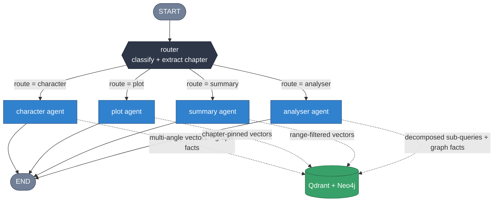
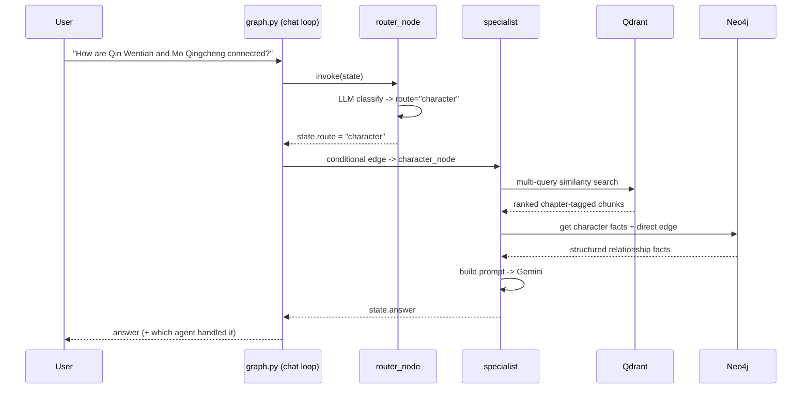
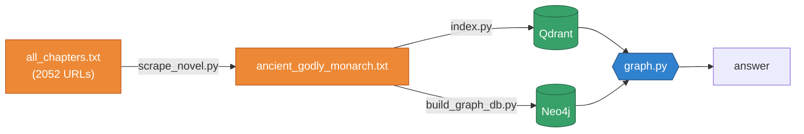
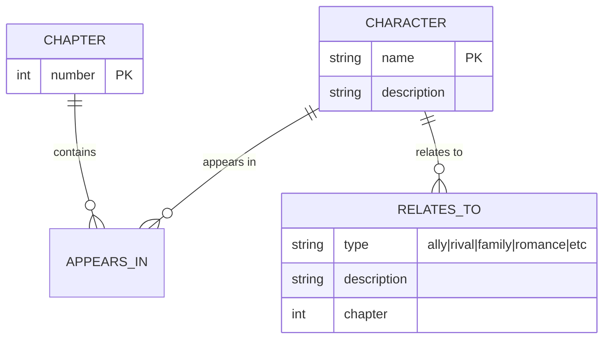

# Ancient Godly Monarch Q&A

A little side project for asking spoiler-heavy questions about *Ancient Godly Monarch*, a web novel that runs 2052 chapters. I'd built a basic RAG setup for it earlier and it kept giving me vague, watered-down answers, so I rewrote it as a small multi-agent thing on LangGraph.

The idea: don't throw every question at the same retrieval pass. A router reads the question first, figures out what kind of question it is, and hands it to one of four agents that each know how to fetch context their own way. Two stores back it:

- Qdrant for semantic search over the chapter text
- Neo4j for a character/relationship graph

Neo4j is optional. If you don't set it up the whole thing just runs vector-only.

## Why I bothered

The old single-pass version had three problems I kept hitting:

1. Plot questions came back flat ("a lot happens in chapter 47") because a blind similarity search wouldn't reliably land on the right chapter.
2. Relationship questions ("how are X and Y connected?") were bad, because the answer usually lives in scattered chunks and the model never saw both sides.
3. It was weirdly shy about spoilers, which is pointless when the whole point is that I've already read it and want to check details.

The router + specialists setup fixes all three, mostly by being more deliberate about what gets retrieved.

## The graph

Router runs first, then a conditional edge jumps straight to whichever specialist matches. The route string the router writes is literally the node name, which keeps the wiring dead simple.



What the four agents actually do:

**router** classifies the question and pulls out a chapter number or range if there is one. If the LLM's JSON comes back malformed it falls back to a dumb keyword heuristic, which is good enough most of the time.

**character** handles people: personality, fate, powers, and relationships. It searches from a few different angles (the plain question, plus "relationship", "fate/death", "powers" variants) and merges the results, then layers in whatever Neo4j knows. Ask about two people and it'll also pull the direct edge between them.

**plot** is for "what happened in chapter N". It pins retrieval to that chapter's metadata so you actually get chapter N and not chapter 47-ish. If the chapter filter comes back empty it widens the search.

**summary** does arcs and chapter ranges, using a range filter on the metadata.

**analyser** is for the big cross-cutting stuff ("how does the cultivation system work over the whole story"). It breaks the question into 3-4 sub-queries, retrieves on each, and synthesises. Also folds in graph facts.

Every prompt tells the model to give full spoilers but stick strictly to the retrieved context. The retrieval depths (`K_CHARACTER`, `K_PLOT`, etc.) live in `config.py` and honestly tuning those up was the single biggest quality win over the old version.

## What a request looks like



If Neo4j isn't reachable, `is_available()` returns False and the agents just skip the graph bits. You'll see `Knowledge graph (Neo4j): off (vector-only)` printed on startup.

## How the data gets in

Three build scripts, all independent. You can get the vector side working first and add the graph later (or never).



`scrape_novel.py` pulls the chapters with Playwright. It's resumable (checkpoints every 30 chapters and skips anything already scraped), which you'll want because 2052 chapters takes a while and the site is JS-heavy.

`index.py` splits on the `Chapter N` delimiter, chunks inside each chapter, and tags every chunk with its chapter number. That tag is the whole trick that lets the plot/summary agents retrieve by chapter.

`build_graph_db.py` runs one LLM call per chapter to pull out characters and relationships and writes them to Neo4j. One call per chapter means it's slow and burns tokens, so use `--limit` while you're testing.

## The graph schema

Pretty minimal. Characters, chapters, and the two edge types:



In Cypher:

```cypher
(:Character {name, description})
(:Chapter {number})
(c:Character)-[:APPEARS_IN]->(ch:Chapter)
(a:Character)-[:RELATES_TO {type, description, chapter}]->(b:Character)
```

## Files

```
config.py           all settings (Gemini, Qdrant, Neo4j) in one place
scrape_novel.py     scrape the novel into a text file (resumable)
index.py            chapter-aware vector indexing -> Qdrant
build_graph_db.py   LLM extraction of characters/relationships -> Neo4j
retrieval.py        Qdrant helpers (chapter / range / multi-query)
neo4j_store.py      Neo4j connection + Cypher + the graceful fallback
agents.py           router + the 4 specialists
graph.py            LangGraph wiring + chat loop -- run this one
docker-compose.yml  Qdrant + optional local Neo4j
requirements.txt
test.py             old chapter "patcher" that fills gaps in an existing file
all_chapters.txt    the 2052 chapter URLs
```

## Running it

Set up the environment:

```bash
python -m venv venv
source venv/bin/activate          # Windows: venv\Scripts\activate
pip install -r requirements.txt
pip install playwright            # only needed for scraping
playwright install chromium
```

Copy the env file and fill it in. You need a `GOOGLE_API_KEY` at minimum. The Neo4j vars are optional, leave them blank to run vector-only. Aura URLs look like `neo4j+s://xxxx.databases.neo4j.io`.

```bash
cp .env.example .env
```

Start the stores:

```bash
docker-compose up -d
```

Qdrant dashboard is at http://localhost:6333/dashboard, Neo4j browser (if you're running it locally) at http://localhost:7474.

Now scrape a few chapters to make sure it works before committing to the full run:

```bash
python scrape_novel.py --limit 50
python index.py
python build_graph_db.py --limit 50
```

And ask things:

```bash
python graph.py
```

Once you're happy, drop the `--limit` flags and let the full scrape/index run. The scraper is resumable so you can Ctrl-C and come back.

## Things to ask it

- "What happened in chapter 47?" goes to the plot agent
- "What's the relationship between Qin Wentian and Mo Qingcheng?" goes to character (and uses the graph)
- "Summarise the Emperor Star Academy arc" goes to summary
- "How does the cultivation power system work across the story?" goes to analyser

## Stack

LangGraph for the orchestration, Gemini 2.5 Flash as the LLM, `gemini-embedding-2-preview` for embeddings (3072 dims, cosine), Qdrant for vectors, Neo4j 5 for the graph, Playwright for scraping.

## Notes to self

- `index.py` and `build_graph_db.py` don't depend on each other, run whichever you want.
- Re-run `index.py` after any re-scrape, the chapter metadata is what plot/summary lean on.
- Don't commit `.env`. It's gitignored but still.